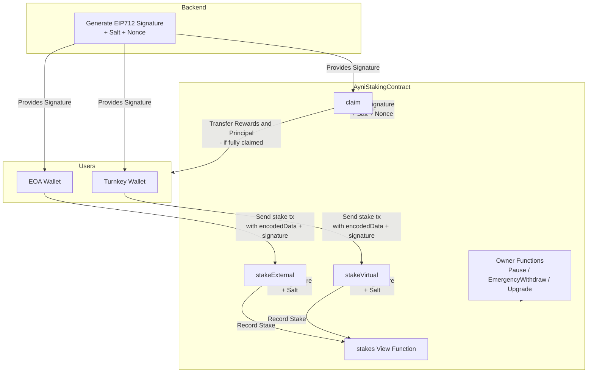

# AyniStaking
AyniStaking is a smart contract that enables users to stake tokens and earn rewards over time. It supports both external and virtual staking methods, allowing users to stake tokens through any EOA wallet or a turnkey wallet. The contract incorporates EIP712 signatures for secure off-chain authorization, preventing replay attacks with unique salts and nonces. It also includes features for pausing the contract, emergency withdrawals, and ownership management. The contract is upgradeable using the UUPS proxy pattern, ensuring flexibility for future enhancements.

## Overview
- **Staking Tokens**: Users can stake a specified amount of tokens for a defined interval (in months) to earn rewards based on backend-generated EIP712 signatures.
- **External Staking**: Users can stake tokens through any EOA wallet by providing a backend-signed authorization.
- **Virtual Staking**: Users can stake tokens through a turnkey wallet by providing a backend-signed authorization. Fees will be deducted in stakeed token equivalent to gas fees used. While at the time of function eexecution, Zero dev wallet will sponsor gas fee.
- **Claiming Rewards**: Users can claim their staking rewards based on the backend-generated EIP712 signatures. The contract ensures that claims are authorized and prevents replay attacks using salts and nonces.

## Flow Diagrams

### 🔹 System Flow (Staking + Claim Overview)



## Methods

### stakeExternal

```solidity
function stakeExternal(bytes _encodedData, bytes _signature) external nonpayable
```

Allows a user to stake tokens by providing a backend-signed authorization through any EOA wallet. Emits a {Staked} event after a successful stake.

*Uses EIP712 typed data signatures to verify off-chain authorization.      Prevents replay attacks using unique salts and ensures the stake does not already exist.*

#### Parameters

| Name | Type | Description |
|---|---|---|
| _encodedData | bytes | ABI-encoded data containing:        - destinationAddress: A turnkey address where rewards will be claimed        - stakeId: unique identifier for this stake        - endTime: timestamp when the stake fully mature.        - interval: staking interval in months (e.g., 12 for 12 months)        - amount: amount of tokens to stake        - userId: unique user identifier from backend        - salt: unique salt to prevent replay |
| _signature | bytes | Backend-generated EIP712 signature authorizing the stake. |

### stakeVirtual

```solidity
function stakeVirtual(bytes _encodedData, bytes _signature) external nonpayable
```

Allows a user to stake tokens by providing a backend-signed authorization through turnkey wallet.Emits a {Staked} event after a successful stake.

*Uses EIP712 typed data signatures to verify off-chain authorization.      Prevents replay attacks using unique salts and ensures the stake does not already exist.*

#### Parameters

| Name | Type | Description |
|---|---|---|
| _encodedData | bytes | ABI-encoded data containing:        - sourceAddress: address from which tokens will be staked        - stakeId: unique identifier for this stake        - interval: staking interval in months (e.g., 12 for 12 months)        - endTime: timestamp when the stake fully mature.        - amount: amount of tokens to stake        - feeTokens: amount of tokens to be deducted as gas fee        - userId: unique user identifier from backend        - salt: unique salt to prevent replay |
| _signature | bytes | Backend-generated EIP712 signature authorizing the stake. |

### claim

```solidity
function claim(bytes _encodedData, bytes _signature) external nonpayable
```

Allows a user to claim their staking rewards for a specific stake via destinationAddress.Emits a {Claimed} event after successful reward claim.

*Verifies backend-generated EIP712 signature to ensure authorized claims. Uses salts and nonces to prevent replay attacks. Transfers preclaim rewards in `rewardToken` and returns principal if the stake is fully claimed.*

#### Parameters

| Name | Type | Description |
|---|---|---|
| _encodedData | bytes | ABI-encoded data containing:        - stakeId: unique identifier of the stake        - interval: staking interval in months (e.g., 12 for 12 months)        - rewards: amount of reward tokens to claim        - claimedMonth: the month up to which the reward is being claimed        - expiry: signature expiry timestamp        - userId: unique user identifier        - salt: unique salt to prevent replay attacks        - nonce: unique nonce for additional replay protection |
| _signature | bytes | Backend-generated EIP712 signature authorizing the claim. |


### stakes

```solidity
function stakes(bytes32, uint256, uint256) external view returns (uint256 amount, uint256 startTime, uint256 endTime, uint256 claimedAmount, uint256 claimedUntilMonth, address staker, address claimAddress, bool isClaimed, bool isActive)
```

#### Parameters

| Name | Type | Description |
|---|---|---|
| _0 | bytes32 | undefined |
| _1 | uint256 | undefined |
| _2 | uint256 | undefined |

#### Returns

| Name | Type | Description |
|---|---|---|
| amount | uint256 | undefined |
| startTime | uint256 | undefined |
| endTime | uint256 | undefined |
| claimedAmount | uint256 | undefined |
| claimedUntilMonth | uint256 | undefined |
| staker | address | undefined |
| claimAddress | address | undefined |
| isClaimed | bool | undefined |
| isActive | bool | undefined |
